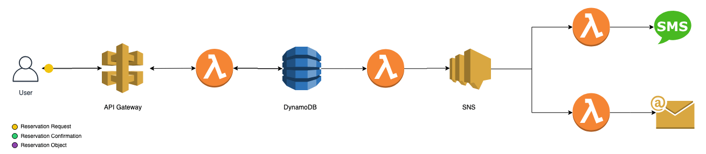

## Description
"Sto Psito" is Greek restaurant located in [Kefalonia, Greece](https://goo.gl/maps/rGNRG2g3ZwP2). First opened in 1990, is still a favourite among locals as well as tourists.

Last year, the website had: 
- Hundreds of unique visitors every month,
- Over 50 people reserved a table through the website,
- 3 wedding parties were booked in the same way. 

The total cost of running the website as well the reservation system came to **$0**. This project wants to make the case that small businesses can run succesfull and profitable websites without having to spend a lot of money (if any at all!).

## SAM Architecture
The SAM reservation system consists of 4 processes:
1. User interaction with the website (Reservation Request),
1. Handling the request, persisting it into a database,
1. Notify other services that a new reservation has entered the system,
1. Listen for the event and act as required.

The GIF bellow illustrates the journey that a single reservation request makes. 



## How to use
To run the whole infrastructure: 
```
$ ./deploy.sh {aws_profile}
```

Obviously, some names and the profile used in cloudformation will need to change in order to accommodate your application. 

## License 
No license. This software may be re-used or changed as seem fit.
